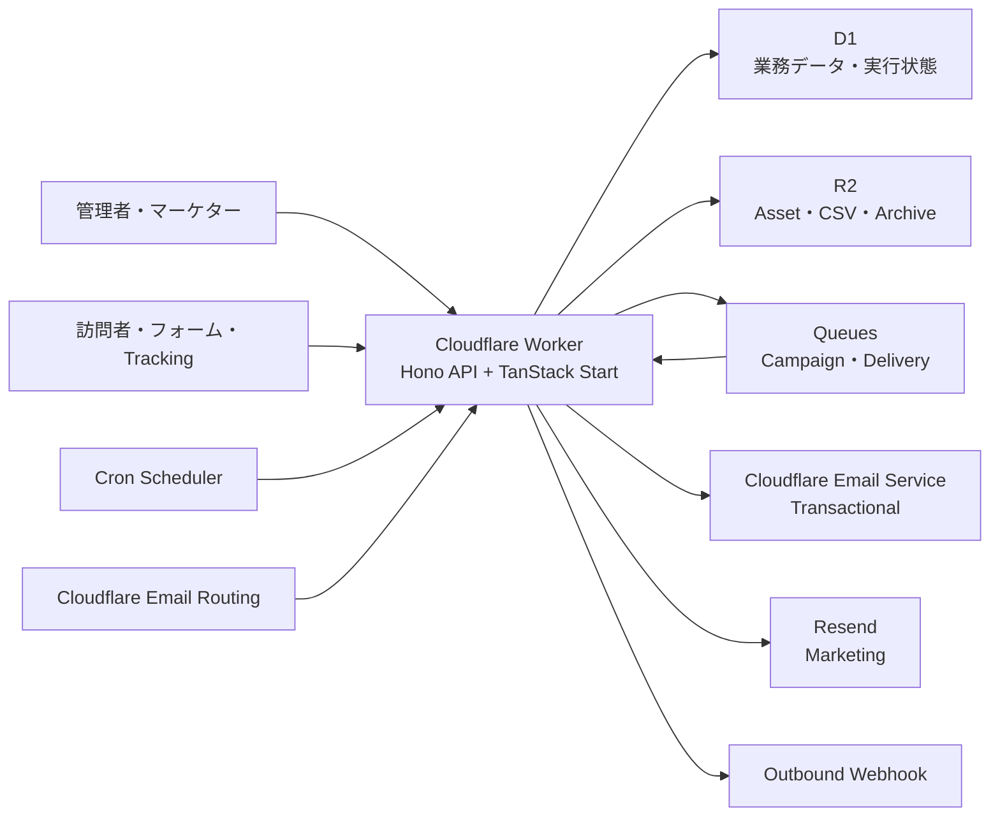

# Kaenma

Cloudflare上で完結する、オープンソースのマーケティングオートメーション基盤です。

Mauticの「Contact・Segment・Form・Content・Score・Campaign・計測」という考え方を、TypeScriptとCloudflare Workers向けに再構築しています。Mautic APIやPHPプラグインとの互換性は目的としていません。

> [!IMPORTANT]
> 現在は `v0.1` の開発版です。本番投入前に、送信ドメイン、同意要件、Resend設定、負荷特性、バックアップ手順を環境ごとに検証してください。

## 特徴

- 単一のCloudflare WorkerからoRPC・REST APIとTanStack Start管理画面を配信
- D1を業務データとキャンペーン状態機械の正本として使用
- R2によるAsset、CSV、受信添付ファイル、イベントアーカイブの保存
- Queuesと1分Cronによる再開可能なキャンペーン実行
- Cloudflare Email ServiceによるTransactionalメール
- Resend Emails APIによるMarketingメール
- React Flowを使ったビジュアルキャンペーンビルダー
- Better Authのメール認証、Organization、RBAC、任意のTOTP
- Workspace限定APIキー、TypeScript SDK、MCPサーバー
- 対話式セットアップ、`doctor`、`backup`、`update` CLI

## メール送信ポリシー

Kaenmaはメールの用途を型と実行時検証の両方で分離します。

| 用途 | 既定プロバイダー | 使用例 |
| --- | --- | --- |
| `transactional` | Cloudflare Email Service | メール確認、招待、パスワード再設定、申込確認 |
| `marketing` | Resend | Campaign、Segment配信、Broadcast |

Cloudflare Email ServiceをMarketing用途で選択すると、キャンペーン公開時と送信時の両方で拒否されます。

## アーキテクチャ



長時間のDelayはQueueに保持せず、D1の`campaign_jobs.due_at`に保存します。Cronが期限到達Jobをleaseし、Queueへ渡します。Queue consumerは送信直前に同意、抑止、購読Topic、頻度上限、キャンセル状態を再確認します。

## リポジトリ構成

```text
apps/
  client/                TanStack Start/Query、Vite、Tailwind、React Flow
  server/                Hono API、Cron、Queue、Email Routing
packages/
  contract/              管理画面とWorkerで共有するoRPC contract
  channels/              Cloudflare、Resend、Webhook adapter
  core/                  Segment、Campaign、Consent、Schedule
  create-kaenma/         Setup、doctor、backup、update CLI
  database/              Drizzle schema/client、D1 migration、repository
  email-renderer/        安全なHTML/Text renderer
  mcp-server/            Kaenma MCP server
  sdk/                   TypeScript SDK
  shared/                Zod schema、DTO、公開型、OpenAPI
```

## 必要環境

- Node.js 22.12以上
- pnpm 11
- Cloudflareアカウント
- Workers Paidプランを推奨
- D1、R2、Queues
- Cloudflare Email ServiceとEmail Routing
- Marketingメールを送る場合はResend

## ローカル開発

### 1. 依存関係

```bash
pnpm install
```

### 2. 開発用Secret

```bash
cp .dev.vars.example apps/server/.dev.vars
```

少なくとも次の値を設定します。

```dotenv
BETTER_AUTH_SECRET=32文字以上のランダム値
CREDENTIAL_ENCRYPTION_KEY=32バイト相当のランダム値
TRACKING_SIGNING_SECRET=32文字以上のランダム値
TURNSTILE_SECRET=任意
RESEND_API_KEY=Marketingメールを利用する場合は必須
RESEND_WEBHOOK_SECRET=Resend Webhookを利用する場合は必須
```

`CREDENTIAL_ENCRYPTION_KEY`は、Outbound Webhookの署名資格情報をD1へ保存する際のAES-GCMマスターキーです。運用開始後に不用意に変更すると、保存済み資格情報を復号できなくなります。
Resendの資格情報はD1へ保存せず、WorkerのSecret bindingからのみ読み込みます。

### 3. D1 migration

```bash
pnpm db:migrate:local
```

アプリケーションからのDBアクセスは`@kaenma/database`のDrizzle clientへ統一しています。
テーブル定義は`packages/database/src/auth-schema.ts`と
`packages/database/src/business-schema.ts`が正本です。スキーマ変更時は次のコマンドで
Drizzle Kitの差分SQLを生成してレビューできます。

```bash
pnpm db:generate
```

既存環境とのmigration履歴互換性を維持するため、Wranglerが実際に適用する連番SQLは
引き続き`packages/database/migrations`へ配置します。

### 4. 起動

```bash
pnpm dev
```

`pnpm dev`は未適用のローカルD1 migrationを先に適用してから開発サーバーを起動します。

管理画面とAPIは `http://localhost:5173` で利用できます。

開発環境では登録時のメール確認を省略し、アカウント作成後にそのままログインします。本番環境ではメール確認が必須です。

管理画面とAPIをTanStack StartのVite開発サーバーで起動する場合:

```bash
pnpm dev:client
```

## Cloudflareへのデプロイ

### Wrangler設定

`apps/server/wrangler.jsonc`に以下のBindingsが定義されています。

- `DB`: D1
- `ASSETS_BUCKET`: R2
- `CAMPAIGN_QUEUE`: Campaign、Broadcast、Import/Export
- `DELIVERY_QUEUE`: Email、Webhook delivery
- `EMAIL`: Cloudflare Email Service

TanStack StartのSSR WorkerとクライアントアセットはCloudflare Viteプラグインが同じデプロイ成果物へまとめます。

初期状態のD1 `database_id` はプレースホルダーです。実際のD1 IDへ置き換えてください。

### Secret登録

```bash
cd apps/server
pnpm wrangler secret put BETTER_AUTH_SECRET
pnpm wrangler secret put CREDENTIAL_ENCRYPTION_KEY
pnpm wrangler secret put TRACKING_SIGNING_SECRET
pnpm wrangler secret put TURNSTILE_SECRET
pnpm wrangler secret put RESEND_API_KEY
pnpm wrangler secret put RESEND_WEBHOOK_SECRET
```

Resend Dashboardには`https://<APP_URL>/api/webhooks/resend/<WORKSPACE_ID>`をWebhook URLとして登録し、`email.sent`、`email.delivered`、`email.opened`、`email.clicked`、`email.bounced`、`email.complained`、`email.failed`、`email.suppressed`を購読します。発行されたSigning secretは`RESEND_WEBHOOK_SECRET`として登録してください。

### Migrationとデプロイ

```bash
pnpm db:migrate:remote
pnpm deploy
```

Worker build時にTanStack StartのSSR bundleとクライアントアセットもビルドされ、同時にデプロイされます。

## 初回セットアップ

1. 管理画面でアカウントを登録する
2. 確認メールからメールアドレスを検証する
3. OrganizationとしてWorkspaceを作成する
4. 必要に応じて購読Topicを作成する
5. WorkerのSecret bindingへResendのAPI keyとWebhook signing secretを登録する
6. ContactまたはCSVを取り込む
7. SegmentとEmail Templateを作成する
8. Campaignを作成・検証・公開する

Better AuthのOrganizationをKaenmaのWorkspaceとして扱います。

| Role | 主な権限 |
| --- | --- |
| Owner | Workspace全体、メンバー、設定 |
| Admin | 設定、APIキー、Webhook、運用 |
| Marketer | Contact、Content、Campaign、配信 |
| Analyst | 閲覧、分析、Export |
| Viewer | 閲覧 |

## キャンペーン

Campaignは次のNodeから構成されます。

- `Source`: Segment参加、Form送信、Contact作成、API/Webhookイベント
- `Action`: Email、Webhook、Tag、Segment、Score、Field更新
- `Condition`: Contact属性、Tag、Scoreなどの条件分岐
- `Decision`: Open、Click、Reply、Page view、Form submission
- `Delay`: 相対時間、絶対日時、曜日・時間帯

公開時に以下を検証します。

- Sourceが一つだけ存在する
- Node IDとEdge IDが重複していない
- Edgeの接続先が存在する
- Node種別に対してBranchが正しい
- 循環がない
- Sourceから到達不能なNodeがない
- MarketingメールがResendを使用している

公開バージョンは不変です。公開後は同じグラフから新しいdraftが作られ、進行中Contactは参加時のバージョンを完走します。

## Broadcast

BroadcastはMarketingメール専用です。

1. 開始時刻をD1へ記録
2. Segmentの受信者を`broadcast_recipients`へ分割スナップショット
3. 同じDelivery Queueへ投入
4. 送信直前に同意と抑止を再評価
5. Resend Emails APIで受信者ごとに送信

CampaignメールとBroadcastは同じDeliveryテーブル、同意判定、イベント正規化を使用します。

## CSV Import / Export

CSV ImportはWorkerで検証後、R2へNDJSONパートとして保存し、Queueで分割処理します。

最低限、次のどちらかの列が必要です。

```text
email
external_id
```

認識する標準列:

```text
email,external_id,first_name,last_name,phone,stage
```

その他の列はCustom Fieldとして保存されます。ExportはCSV数式インジェクションを避けるため、`=`, `+`, `-`, `@`から始まる値をエスケープします。

## REST API

APIのベースパスは `/api/v1` です。
管理画面のBetter Auth以外の通信はoRPCの`/api/rpc`を使用します。
Workspace・Contactには専用の型付きprocedureを使用し、その他の管理画面APIも
oRPC adapterからWorker内の既存業務handlerを呼び出します。
SDK・MCP・外部連携向けのREST APIは`/api/v1`で互換性を維持します。
管理画面の取得・更新状態はTanStack Queryで管理し、oRPC contractからquery keyと
query/mutation optionsを生成します。

OpenAPI:

```text
GET /api/openapi.json
```

主なEndpoint:

```text
GET    /api/v1/contacts
POST   /api/v1/contacts
GET    /api/v1/contacts/:id/timeline
POST   /api/v1/contacts/import
POST   /api/v1/contacts/export

GET    /api/v1/segments
POST   /api/v1/segments
POST   /api/v1/segments/preview

GET    /api/v1/campaigns
POST   /api/v1/campaigns
PUT    /api/v1/campaigns/:id/draft
POST   /api/v1/campaigns/:id/publish
POST   /api/v1/campaigns/:id/enroll

GET    /api/v1/broadcasts
POST   /api/v1/broadcasts
POST   /api/v1/broadcasts/:id/start

GET    /api/v1/email-templates
POST   /api/v1/email-templates
GET    /api/v1/forms
POST   /api/v1/forms
GET    /api/v1/pages
POST   /api/v1/pages
```

APIではbodyやqueryの`workspace_id`を信用しません。Cookie SessionまたはBearer API KeyからWorkspaceを決定し、D1クエリにも必ず`workspace_id`を含めます。

## TypeScript SDK

```ts
import { KaenmaClient } from "@kaenma/sdk";

const kaenma = new KaenmaClient({
  baseUrl: "https://ma.example.com",
  apiKey: process.env.KAENMA_API_KEY!,
});

const contacts = await kaenma.contacts.list({
  query: "example.com",
  limit: 25,
});

await kaenma.contacts.create({
  email: "person@example.com",
  firstName: "Kaen",
  customFields: {
    plan: "pro",
  },
});
```

APIキーはWorkspace限定で、D1にはSHA-256ハッシュだけを保存します。平文キーは作成時に一度だけ表示されます。

## MCPサーバー

ビルド:

```bash
pnpm --filter @kaenma/mcp-server build
```

環境変数:

```bash
export KAENMA_URL=https://ma.example.com
export KAENMA_API_KEY=kaenma_xxxxxxxxxxxx_xxxxxxxxxxxxxxxxxxxx
node packages/mcp-server/dist/index.js
```

提供する主なTool:

- Contact検索
- Dashboard集計
- Campaign一覧とdraft取得
- Campaign enrollmentの準備
- 明示確認後のCampaign enrollment

実配信につながるCampaign enrollmentは二段階です。準備Toolが短時間有効な確認Tokenを発行し、確認Toolで `CONFIRM SEND` を明示しない限り実行されません。

## セットアップCLI

ローカルでCLIをビルド:

```bash
pnpm --filter create-kaenma build
```

主なコマンド:

```bash
node packages/create-kaenma/dist/index.js
node packages/create-kaenma/dist/index.js doctor
node packages/create-kaenma/dist/index.js backup
node packages/create-kaenma/dist/index.js update
node packages/create-kaenma/dist/index.js domain add
```

`create-kaenma`はD1、R2、Queues、Secrets、Migration、Worker deploymentを順番に構成します。

開発中のローカルテンプレートを使う場合:

```bash
KAENMA_TEMPLATE_DIR=/path/to/kaenma node packages/create-kaenma/dist/index.js
```

GitHub・npm公開後は`npx create-kaenma`として利用する予定です。`KAENMA_TEMPLATE_REPOSITORY`でclone元も変更できます。

## Email Routing

CampaignとBroadcastは、署名付きのReply-Toアドレスを生成します。

```text
r+<signed-token>@reply.example.com
```

Email Routing handlerは次を確認します。

- TokenのHMAC署名と有効期限
- Workspace、Delivery、Contactの一致
- 受信メールが5MB以下
- Reply先Deliveryが存在する

本文はD1、添付ファイルはR2へ保存し、`replied` Delivery EventとContact Eventを生成します。

## 同意と配信停止

- Topic別購読
- グローバル配信停止
- Bounce、Complaint、手動抑止
- 24時間単位の頻度上限
- ワンクリック解除
- Preference Center
- 送信直前の再判定

TransactionalメールもBounce、Complaintなどの抑止対象です。Marketingメールはさらにグローバル停止、Topic状態、頻度上限を確認します。

## セキュリティ

- 全業務テーブルと主要Indexに`workspace_id`
- Session/API KeyからWorkspace Contextを決定
- Secure、HttpOnly、SameSite Cookie
- Cookieを使う変更系APIでOriginを検証
- Segment ASTを許可済み演算子からparameterized SQLへ変換
- Campaign公開時のグラフ検証
- Provider credentialをAES-GCMで暗号化
- WebhookをHMAC、timestamp、event IDで検証
- Tracking、解除、Reply TokenをHMAC署名
- Webhook送信先のHTTPS強制とprivate/link-local IP拒否
- Email HTMLの変数escapeと許可タグ制限
- FormのTurnstile、honeypot、Origin制限、Idempotency Key
- Queue consumerの条件付き状態更新とDelivery冪等キー

脆弱性を発見した場合は、公開Issueへ機密情報を書き込まず、RepositoryのSecurity Advisoryから報告してください。

## テスト

全体:

```bash
pnpm check
```

個別:

```bash
pnpm typecheck
pnpm test
pnpm build
```

WorkerテストはCloudflare Workers Vitest integration上で実行し、実際のD1 migrationを空DBへ適用します。

現在のテスト対象には以下が含まれます。

- Segment ASTのSQL parameter binding
- Campaignの循環、到達性、Provider制約
- 同意判定
- Job状態遷移とRetry
- Email rendererのescape
- Webhook URLのSSRF対策
- WorkspaceをまたぐContact直接参照の拒否
- Idempotency Keyの重複予約
- Worker healthとD1 migration

## 現在の制約

- `wrangler.jsonc`のD1 ID、送信元ドメイン、Reply domainは環境ごとの設定が必要です。
- Resend Webhookは`/api/webhooks/resend/:workspaceId`で受け取り、raw bodyと`svix-*`ヘッダーを使ってResend標準の署名を検証します。
- 大規模なCSVやSegmentは、実データ分布を使った負荷試験が必要です。
- D1は唯一の業務DBですが、古い詳細イベントと大容量ファイルはR2へ退避します。
- SMS、LINE、Push、Mautic API/PHPプラグイン互換、SAML/SCIMは対象外です。
- Cloudflare上の実リソースを必要とするProvider smoke testはCIだけでは完結しません。

## 開発ロードマップ

- 管理画面のLanding Page、Project、Broadcast編集UIの拡充
- Click redirectの完全なリンク書き換え
- Segment差分評価と大規模データ向けQuery最適化
- R2アーカイブの復元・検索Tool
- Provider contract testと負荷試験Fixture
- `create-kaenma`のnpm公開
- デモWorkspaceとCampaign Template

## コントリビューション

IssueやPull Requestを歓迎します。

変更前に次を実行してください。

```bash
pnpm check
```

## ライセンス

[MIT License](./LICENSE)
